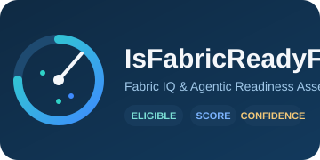

<p align="center">
  
</p>

# 🧠 IsFabricReadyForIQ

**Fabric IQ & Agentic Readiness Assessment** — score whether a Power BI / Microsoft
Fabric tenant and its objects (tenant, workspace, semantic model, report, Fabric Data
Agent) are ready for **Fabric IQ**, fully offline-testable, zero manual guesswork.

| | |
|---|---|
| 🏷️ **Ruleset** | `2026.09.1` · package `0.1.0` |
| ✅ **Tests** | 244 tests passed — engine, rules, scoring, trends, preceptor, deployment, installer |
| 🐍 **Python** | 3.12+ · zero external dependencies |
| 📜 **License** | Internal — see repository settings |
| 🎯 **Coverage** | 65 rules · 5 object types · 7 Gold marts · 13-agent environment |

For every object the tool produces:

| Result | Question it answers |
|--------|--------------------|
| 🚧 **Eligibility** | Does anything make this object structurally impossible to use? |
| 📈 **Readiness score** (0–100) | How well prepared is it, across weighted dimensions? |
| 🔍 **Confidence** | How much of it could we actually observe? |
| 🛠️ **Remediation backlog** | What to change, who owns it, how long it takes |

> [!IMPORTANT]
> These are **three separate results**. A high score with low confidence is a statement
> about blind spots, not an endorsement — the tool refuses to merge them into one
> reassuring number.

---

## 💡 Why This Exists

The building blocks exist — Scanner APIs, Semantic Link Labs, the Fabric Data Agent SDK,
Microsoft's "prepare data for AI" guidance. What is missing is the layer that walks the
whole chain, from tenant switch to agent answer, and produces a consolidated, explainable
verdict with an owned remediation list. That is this project.

---

## ⚡ Quick Start

```bash
# Score the synthetic sample tenant, with preceptorship review
python assess.py --inventory examples/sample_tenant --review --out artifacts

# Inspect the rule catalogue
python assess.py --list-rules

# Run the test suite
python -m unittest discover -s tests -t .

# Verify multi-agent file ownership
python scripts/check_agent_ownership.py
```

No dependencies. Python 3.12+ standard library only.

### 🚦 Exit Codes

| Code | Meaning |
|------|---------|
| `0` | Assessment completed |
| `1` | Assessment failed (collection, normalization, configuration) |
| `2` | Completed with blocking findings, `--fail-on-blocking` set |
| `3` | Completed but preceptorship escalated, `--fail-on-review` set |

Codes 2 and 3 are pipeline signals, not crashes: a CI gate can tell "the tool broke"
from "the tenant is not ready" without parsing output.

> [!TIP]
> Wire `--fail-on-blocking` into a scheduled pipeline so a tenant that regresses below
> eligibility fails the build loudly, instead of quietly publishing a stale "READY".

---

## 🚀 Deploy To Fabric

The whole assessment also ships as a native Fabric solution — a Lakehouse, a notebook
and a Data Pipeline — so it can run on a schedule inside the estate it evaluates
instead of from someone's laptop.

```powershell
$env:FABRIC_TOKEN  = az account get-access-token --resource "https://api.fabric.microsoft.com" --query accessToken -o tsv
$env:ONELAKE_TOKEN = az account get-access-token --resource "https://storage.azure.com" --query accessToken -o tsv

python fabric\deploy.py --workspace-id <workspace-guid> --tenant-id <entra-tenant-guid>
```

The deployment is idempotent: items are looked up by display name and updated, never
duplicated. The `fabric_iq` package is uploaded as plain sources to `Files/lib` on the
Lakehouse — no wheel, no `%pip install`, because it is standard library only.

Results land in the `FabricIQReadiness` Lakehouse: the medallion layers under
`Files/readiness/`, the HTML report, and the seven Gold marts published as Delta tables
ready for the DirectLake governance semantic model. Deployment also sets the workspace
Spark runtime to **2.0** by default (pass `--skip-spark-runtime-upgrade` to leave it
unchanged).

By default the notebook publishes the DirectLake Delta marts in snapshot mode
(`delta_publish_mode = "overwrite"`), so the report shows the latest readiness run
without duplicate historical rows. The medallion JSONL files still preserve every run;
switch `delta_publish_mode` to `"append"` only for explicit trend experiments.

Full instructions, prerequisites and caveats: [`fabric/README.md`](fabric/README.md).

### 📦 One-Notebook Install (Recommended)

The easiest way to get the whole solution into a workspace: import a single notebook
from GitHub, run it, done. No local Python, no `az` CLI, no service principal.

1. In the target Fabric workspace: **New item ▸ Notebook ▸ Import notebook**, and
   import `fabric/items/Install_IsFabricReadyForIQ.Notebook/notebook-content.py` from
   [github.com/cyphou/FIQA](https://github.com/cyphou/FIQA) (raw file URL).
2. Open the imported notebook, adjust the parameters cell if needed (defaults deploy
   into the current workspace using the `main` branch), and **Run all**.
3. It downloads the public source over plain HTTPS, deploys the five items using
   **your own** delegated Fabric identity (`notebookutils.credentials.getToken` —
   no secrets, ever), and cleans up its temp files.

Full walkthrough, parameter reference and the confidentiality guarantees this notebook
upholds: [docs/INSTALL.md](docs/INSTALL.md).

> [!NOTE]
> The installer never stores a secret. It only ever holds the delegated bearer token
> `notebookutils.credentials.getToken(...)` hands it, in memory, for the run's duration.

---

## 📊 Power BI Report

`assess.py --powerbi <folder>` generates a hand-authored `.pbip` project styled after
the FUAM / Fabric Capacity Metrics visual language: a dark KPI band, status-colored
donut and bar visuals, and a scorecard-detail matrix — built from the run's scorecards,
findings and remediation backlog, with no live connection to your tenant.

```bash
python assess.py --inventory examples/sample_tenant --powerbi ./powerbi_report
```

This writes a self-contained project you open directly in Power BI Desktop:

```
powerbi_report/
├── IsFabricReadyForIQ.pbip
├── IsFabricReadyForIQ.Report/       # report.json (pages/visuals) + report.config.json
├── IsFabricReadyForIQ.SemanticModel/  # model.bim (import-mode TMSL)
├── data/                            # CSV sources: scorecards, findings, backlog
├── FabricIQ_Theme.json              # optional — apply via View ▸ Themes ▸ Browse
└── README.md
```

Constraints: the semantic model's CSV partitions reference **absolute file paths**
generated at write time, so re-open the `.pbip` from the same machine (or update the
paths in Power BI Desktop) after moving the folder. The theme is not auto-applied by
Desktop and must be browsed in manually. Because this environment cannot open Power BI
Desktop, the JSON structure is validated (schema shape, page/visual counts, CSV row
parity with the run) but the visual rendering itself is unverified.

---

## 📚 Rule Catalogue

65 rules, ruleset version `2026.09.1`.

| Object | Rules | Blocking | Prefix |
|--------|-------|----------|--------|
| Tenant | 12 | 4 | `TEN-` |
| Workspace | 11 | 4 | `WKS-` |
| Semantic model | 17 | 5 | `SEM-` |
| Report | 10 | 1 | `REP-` |
| Data Agent | 15 | 10 | `AGT-` |

See [docs/RULES.md](./docs/RULES.md) for the full catalogue.

---

## 🧮 Scoring Contract

- A **blocking** failure caps the score at **39** and revokes eligibility.
- A **major** failure caps the score at **59**.
- A cap only ever lowers a score, never raises one.
- Missing evidence yields `NOT_EVALUATED` — never a pass, never a zero.
- Coverage below **50%** publishes `NOT_EVALUATED` instead of a score.
- Dimension weights are renormalized over observed dimensions, so an unobservable
  dimension lowers **confidence**, not **score**.

| Score | Status |
|-------|--------|
| ≥ 85 | READY |
| ≥ 70 | READY_WITH_CONDITIONS |
| ≥ 50 | REMEDIATION_REQUIRED |
| < 50 | NOT_READY |

Details in [docs/SCORING.md](./docs/SCORING.md).

---

## 🏗️ Architecture

```
Fabric / Power BI APIs → [Collect] → Bronze evidence
                                   → [Normalize] → Silver inventory
                                   → [Score] → Scorecards + Findings
                                   → [Prioritize] → Remediation backlog
                                   → [Review] → Preceptorship verdict
                                   → [Persist] → Lakehouse Gold marts
```

Seven Gold marts feed a DirectLake readiness semantic model and report:

`MartRunSummary`, `MartTenantReadiness`, `MartWorkspaceReadiness`, `MartObjectReadiness`,
`MartBlockingFindings`, `MartRemediationBacklog`, `MartCoverageAndFreshness`.
The model keeps those PascalCase names for business readability, while its DirectLake
partitions point to the Lakehouse SQL endpoint's physical lowercase table names
(`marttenantreadiness`, `martobjectreadiness`, and so on). This keeps the model
AI-readable without breaking table resolution in Fabric.

See [docs/ARCHITECTURE.md](./docs/ARCHITECTURE.md).

The same pipeline runs in two places: locally through `assess.py`, and inside Fabric
through the notebook in [`fabric/items/`](./fabric/items). Both call the identical
`fabric_iq` package, so a local run and a scheduled workspace run produce the same
scorecards.

---

## 🤖 Multi-Agent Environment

The repository ships a 13-agent environment under [.github/agents/](./.github/agents).
Each agent owns a declared set of files; ownership drift fails the build.

| Agent | Owns |
|-------|------|
| 🎼 `@orchestrator` | End-to-end run, CLI surface, exit codes |
| 🔎 `@collector` | Evidence acquisition, Silver inventory normalization |
| 🧮 `@scorer` | Scoring engine, dimension weights, rule registry |
| 🏢 `@tenant` | Tenant & workspace-level rules |
| 📐 `@semantic` | Semantic model & report rules |
| 🕵️ `@dataagent` | Fabric Data Agent readiness rules |
| 🎓 `@preceptor` | Reviews the assessment itself — the preceptorship loop |
| 🛠️ `@remediation` | Backlog prioritization, owner routing |
| 🏛️ `@lakehouse` | Gold marts, persistence, Power BI model & report |
| 🧪 `@tester` | Fixtures, regression coverage, ownership enforcement |
| 📖 `@readme` | Documentation accuracy |
| 🗺️ `@roadmap-planner` | Phase sequencing, release gates |
| 🔐 `@security` | Privacy, least-privilege, secret handling |

### 🔁 The Preceptorship Loop

`@preceptor` reviews the **assessment itself**, not the tenant:

```
DRAFT (run) → REVIEW (@preceptor) → APPROVE? (≥ 4★?)
     ↑                                 │
     │            YES ─────────────────→ PUBLISH
     │             NO ─────────────────→ COACH
     │                                   │
     └───────────────────────────────────┘
              (max 3 cycles, then escalate)
```

Six dimensions: evidence completeness, rule coverage, blocking integrity, remediation
actionability, score traceability, freshness. The failure mode it guards against is not
a wrong score — it is a *confident* score built on thin evidence, because that one gets
acted on.

See [docs/AGENTS.md](./docs/AGENTS.md).

---

## 🛡️ Safety Properties

- **Strictly read-only.** The tool never modifies a tenant, under any flag.
- **Synthetic fixtures only.** No tenant-derived data in the repository.
- **Auditable.** Every finding traces to a hashed, timestamped API payload.

---

## 📌 Status and Limits

The engine, rule catalogue, scoring, review loop and persistence run against offline
fixtures. Phase 1 also supplies a stdlib-only, read-only live collection foundation:
it accepts an injected bearer token, reads tenant settings and Scanner workspace
metadata, follows page links, backs off on `429`, and can resume from a checkpoint.
Use a token environment-variable name rather than placing a token on the command line:

```bash
FABRIC_ACCESS_TOKEN=... python assess.py --live --tenant-id <tenant-id> \
  --bearer-token-env FABRIC_ACCESS_TOKEN --checkpoint artifacts/live-checkpoint.json
```

Live API field coverage has not yet been verified against a tenant; see
[docs/KNOWN_LIMITATIONS.md](./docs/KNOWN_LIMITATIONS.md) before quoting any result as
a tenant assessment.

> [!WARNING]
> This tool never reports a score without eligibility and confidence alongside it —
> a high score at low confidence is a blind spot, not a passing grade.

Roadmap and release gates: [docs/ROADMAP.md](./docs/ROADMAP.md).

---

## 📜 License

Internal project. See repository settings.
